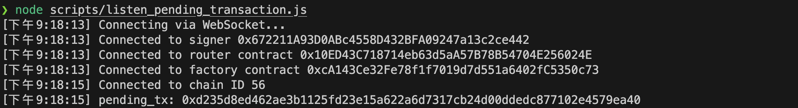
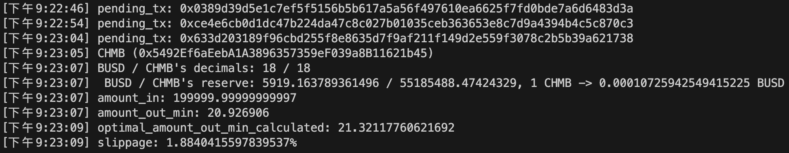

### Install Required Modules
``` shell
    $ pip install requirements.txt
    $ npm install --save-dev hardhat
    $ npm install --save-dev @nomiclabs/hardhat-ethers 
    $ npm install @openzeppelin/contracts
    $ npm install --save-dev @nomiclabs/hardhat-etherscan
    $ npm install dotenv --save-dev
    $ npm install chai --save-dev
```

### Report
[Sandwitch Attack on Pancakeswap V2](https://docs.google.com/presentation/d/1k1JUhJ5bDpUaBilctMYmURTXiCFIcYgXHrl3T08L4Ek/edit#slide=id.p)


### Run
To calculate the slippage, run the following command:

``` shell
    $ node scripts/listen_pending_transaction.js
```


